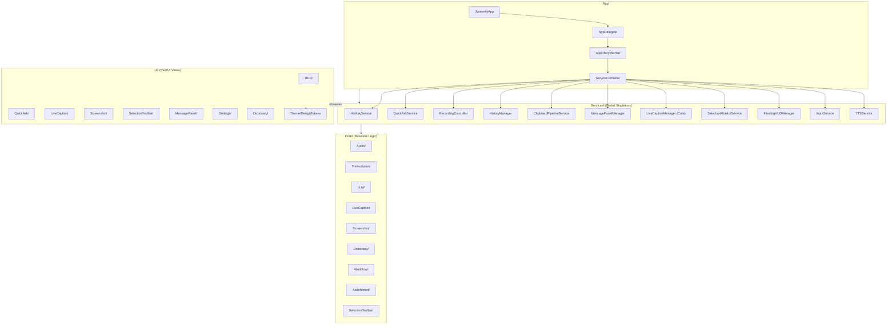

# CLAUDE.md — SpokenAnyWhere

> Native macOS productivity app (macOS 14+). SwiftUI + AppKit hybrid.
> Voice-to-text transcription + AI text processing + real-time captions + screenshot OCR + selection toolbar.

---

## Quick Reference

| Item | Value |
|------|-------|
| Bundle ID | `com.spokeanywhere` |
| Swift tools version | 5.9 |
| Min deployment | macOS 14 (Sonoma) |
| Build system | Swift Package Manager + [Swift Bundler](https://github.com/stackotter/swift-bundler) |
| Source files | 362 Swift (excluding `.build`, `.deprecated`, `archive`) |
| Total LOC | ~227K (includes SPM deps); ~15K project-only |
| Source dirs | `App/`, `Core/`, `Services/`, `UI/` |
| Test dirs | `Tests/` (unit), `Tests/UITests/` (UI) |

---

## Build & Development

```bash
# All commands from spoke/ directory
cd spoke

# Dev build + sign + run with live logging (recommended)
./dev.sh

# Syntax check only
swift build

# Run unit tests
swift test

# Lint
swiftlint

# Live log tail
tail -f .tmp_frames/dev-*.log
grep -E 'error|Error|...' .tmp_frames/dev-*.log
```

**TCC Permissions**: The app requires microphone, screen capture, and accessibility. `dev.sh` handles code signing with developer certificates -- ad-hoc signing breaks TCC.

---

## Architecture



### Directory Map

```
spoke/                          # Main source + build root
├── App/                        # Entry point (10 files)
│   ├── SpokenlyApp.swift       @main — Settings scene + model container
│   ├── AppDelegate.swift       Lifecycle, menu bar, permissions
│   ├── AppLifecyclePlan.swift  Startup orchestration
│   └── App*Runtime*.swift      Feature-specific runtime wiring
│
├── Core/                       # Business logic by feature domain (109 files)
│   ├── Audio/                  Audio capture, callback routing, recovery policy
│   ├── Transcription/          ASR engines (SFSpeech, SpeechAnalyzer), provider abstraction
│   ├── LLM/                    OpenAI-compatible API, pipeline, keychain, prompt rendering
│   ├── LiveCaption/            Real-time caption manager, audio capture, stabilizer, buffer
│   ├── Screenshot/             Capture manager, upscaler, items, settings
│   ├── Dictionary/             Local + remote dictionary, unified service, definition parser
│   ├── Workflow/               Action pipeline, executor, profile resolver, state machine
│   ├── Attachment/             Screen capture, text extraction, attachment management
│   ├── SelectionToolbar/       Toolbar actions, state, action types
│   ├── MessagePanel/           Panel state, card attachments, source app helpers
│   ├── QuickAsk/               Quick ask state, prompt assembler
│   ├── History/                Session history service
│   ├── Tags/                   Card tags, tag library
│   ├── Translation/            Translation service
│   ├── Debug/                  Crash logger, performance tracer, resource monitor
│   ├── Errors/                 Error types
│   ├── Testing/                UITest identifiers
│   ├── Metal/                  GPU compute (placeholder)
│   └── DataModels.swift        SwiftData models: HistoryItem, AppRule, AIProviderConfig
│
├── Services/                   # Global singletons (79 files)
│   ├── ServiceContainer.swift  DI container: lazy resolve + test injection
│   ├── AppSettings.swift       SwiftData-backed user preferences
│   ├── HotKey/                 Global hotkey handling + registry + handler protocols
│   │   └── Handlers/           VoiceHandler, QuickAskHandler, CaptionHandler, ScreenshotHandler
│   ├── QuickAskService.swift   Quick ask panel orchestration
│   ├── RecordingController.swift  Voice recording lifecycle
│   ├── HistoryManager.swift    Persistence + audio storage
│   ├── Clipboard*.swift        Clipboard history + pipeline
│   ├── MessagePanelManager.swift  Message panel orchestration
│   ├── InputService.swift      Keyboard/input simulation
│   ├── AudioPlayerService.swift   Audio playback
│   ├── EdgeTTSService.swift    Edge TTS synthesis
│   ├── DoubaoTTSService.swift  Doubao TTS synthesis
│   ├── SelectionMonitorService.swift  Text selection detection
│   ├── SelectionToolbarManager.swift  Selection toolbar lifecycle
│   ├── FloatingHUDManager.swift   HUD panel management
│   ├── SummaryService.swift    Text summarization
│   ├── VocabularyService.swift Custom vocabulary management
│   ├── ContextService.swift    Frontmost app context
│   ├── TrackpadSwipeService.swift  Swipe gesture handling
│   ├── ImageEnhancementService.swift  Screenshot upscaling
│   └── ScreenOCRService.swift  On-screen OCR
│
├── UI/                         # SwiftUI views (65 files)
│   ├── Theme/DesignTokens.swift   SINGLE SOURCE OF TRUTH for all styles
│   ├── HUD/                   Floating capsule + quick ask capsule + input view
│   ├── QuickAsk/              Answer panel (Input, Recording, Toolbar, Workflow splits)
│   ├── LiveCaption/           Caption window, items, toolbar, vocabulary highlight
│   ├── Screenshot/            Annotation canvas, region selection, action bar, OCR
│   ├── SelectionToolbar/      Selection toolbar view + dictionary result
│   ├── MessagePanel/          Message cards, filters, session history
│   ├── Dictionary/            Dictionary panel, formatted definitions
│   ├── Settings/              Multi-tab settings (AI, General, History, Shortcuts, TTS, etc.)
│   ├── Components/            Shared components (markdown parser, tag bubbles, hover buttons)
│   └── Workflow/              Workflow picker + tag views
│
├── Tests/                      # Unit + UI tests
│   ├── App*Tests.swift         App lifecycle tests
│   ├── Audio*Tests.swift       Audio + recovery policy tests
│   ├── Transcription*Tests.swift  Transcription manager + model tests
│   ├── QuickAsk*Tests.swift    Quick ask prompt + HUD tests
│   ├── Recording*Tests.swift   Recording pipeline + state tests
│   ├── Workflow*Tests.swift    Workflow profile resolver tests
│   ├── TagLibraryTests.swift   Tag library tests
│   ├── Vocabulary*Tests.swift  Vocabulary service tests
│   ├── Screenshot*Tests.swift  Screenshot performance tests
│   ├── Settings*Tests.swift    Settings window tests
│   └── UITests/                UI test target
│
├── Package.swift               SPM manifest (swift-tools-version: 5.9)
├── Bundler.toml                Swift Bundler config (LSUIElement, TCC descriptions)
├── dev.sh                      Dev build + sign + run script
└── Resources/LocalModels/      Local model files (gitignored)
```

---

## Key Patterns

### Service-Oriented Architecture
- **ServiceContainer** (`Services/ServiceContainer.swift`): Singleton DI container with lazy resolution. Services accessed via `ServiceContainer.shared.xxx`. Test injection via `register()` methods.
- **Protocols + Concrete Types**: Every major service has a protocol (`*Protocol`) and a concrete type. ServiceContainer stores both, allowing mock injection.
- **Environment Key**: `\.services` provides ServiceContainer to SwiftUI views.

### File Naming Conventions
| Suffix | Purpose |
|--------|---------|
| `*LiveDependencies.swift` | Factory closures for real (non-test) service creation |
| `*RuntimeHelpers.swift` | Extension/helpers used at runtime but auto-extracted from main source |
| `*LiveHelpers.swift` | Live implementation helpers |
| `*LiveDependencies.swift` | Same pattern as above, for services in Services/ dir |

### SwiftData Models
- `HistoryItem` — voice recordings + processed text (tags, record types: normal/todo/done/note)
- `AppRule` — per-app custom prompts
- `AIProviderConfig` — LLM provider credentials (API key in Keychain)

### UI Patterns
- **NSPanel/NSWindow** for floating UIs (always-on-top, click-through)
- **`os.Logger`** with subsystem `com.spokeanywhere` for structured logging
- **`DesignTokens`** is the ONLY source for colors, spacing, typography, animations, shadows

---

## Styling (Mandatory)

All UI styling MUST use `DesignTokens`. No hardcoded values anywhere.

```swift
// Correct
.foregroundColor(DesignTokens.Colors.textPrimary)
.cornerRadius(DesignTokens.CornerRadius.lg)
.font(DesignTokens.Typography.body)
.padding(DesignTokens.Spacing.md)

// Forbidden
.foregroundColor(Color.white.opacity(0.9))
.cornerRadius(14)
.font(.system(size: 14))
.padding(8)
```

DesignTokens covers: `Colors`, `Gradients`, `CornerRadius`, `Spacing`, `Typography`, `Animation`, `Shadow`, `Layout`, `BorderWidth`, `LineSpacing`, and `Colors.NS` (AppKit variant).

Reference: `spoke/UI/Theme/DesignTokens.swift`

---

## Tech Stack

| Layer | Technology |
|-------|-----------|
| Language | Swift 5.9+ |
| UI Framework | SwiftUI + AppKit hybrid |
| Persistence | SwiftData |
| Build | Swift Package Manager |
| Packaging | [Swift Bundler](https://github.com/stackotter/swift-bundler) |
| SPM Deps | `swift-identified-collections` (Point-Free) |
| System Frameworks | AVFoundation, Speech, ScreenCaptureKit, Vision, Carbon (hotkeys) |
| Logging | `os.Logger` (subsystem: `com.spokeanywhere`) |

---

## Constraints

- **No private APIs** — must maintain App Store compliance
- **Preserve backward compatibility** unless explicitly approved
- **Run Swift commands from `spoke/` directory**
- **UI must use DesignTokens exclusively** — no hardcoded colors, radii, fonts, or spacing
- **LSUIElement = true** — app is faceless (no dock icon by default)
- All `@MainActor` services are accessed through `ServiceContainer`

---

## Documentation Index

| Path | Content |
|------|---------|
| `docs/prd.md` | Product requirements |
| `docs/design.md` | Technical design overview |
| `docs/design-quick-ask.md` | Quick Ask feature design |
| `docs/design-llm-pipeline.md` | LLM pipeline architecture |
| `docs/design-transcription-models.md` | Transcription model system |
| `docs/design-workflow.md` | Workflow engine design |
| `docs/design-history-manager.md` | History management design |
| `docs/style/` | Design system specification |
| `docs/memo/` | Development notes and decisions |
| `docs/roadmap.md` | Project roadmap |
| `docs/architecture/` | Architecture audit docs |
| `AGENTS.md` | Extended agent guidelines with skills system |

---

*Last updated: 2026-04-07 | Generated by ccg:init*
