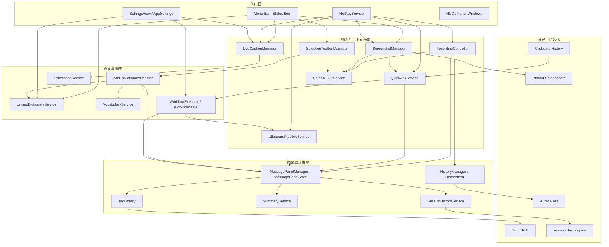

# SpokenAnyWhere 能力图谱

**版本**: 1.0
**更新时间**: 2026-04-07
**定位**: 在 `overview.md` 与 `quick-reference.md` 之间补一层“能力关系图”，帮助回答“这些功能域是怎么彼此挂接的”。

---

## 一、图谱摘要

SpokenAnyWhere 当前不是单一“语音转文字”应用，而是围绕多个入口面和多个内容域协作的 macOS 生产力系统：

- 入口面：菜单栏、全局热键、HUD / 浮窗、设置页
- 高频能力：语音输入、Quick Ask、截图、OCR、Selection Toolbar、实时字幕
- 内容聚合域：Message Panel、Session History、Summary、Tags
- 语义增强域：Dictionary、Vocabulary、Translation、Workflow
- 资产与持久化：HistoryItem、录音文件、pinned screenshots、剪贴板历史、标签库、词典训练短语

它更像“一组围绕输入、上下文采集、LLM 处理、结果沉淀的协同能力”，而不是一条线性流水线。

---

## 二、Mermaid 能力关系图

---

## 三、关键深层域

### 3.1 Message Panel / Clipboard / Session History / Summary / Tags

这条线不是“附属 UI”，而是当前仓库里最像内容中枢的域。

- `MessagePanelManager` 负责窗口生命周期、显示隐藏、外部内容注入，并且在 hover state 里就已经接了图片粘贴和剪贴板注入入口。
- `MessagePanelState` 管理的是卡片流，不只是字符串列表。卡片本身可以携带：
  - `recordType`
  - `tagIds`
  - `attachments`
  - `sourceApp`
  - `summary / summaryStatus`
- `SessionHistoryService` 单独管理 conversation / transcription 两种会话记录，并持久化到 `session_history.json`。
- `SummaryService` 直接围绕 `MessageCard` 工作，可读取附件、抓取 URL 内容，再通过 LLM 生成摘要。
- `TagLibrary` 是全局标签库，负责标签 CRUD、最近使用、JSON 持久化，并通过通知驱动 Message Panel 侧同步移除引用。

这说明：Message Panel 不是单纯“显示结果”，而是在承担一个可沉淀、可分类、可回放、可补充语义的内容工作台。

### 3.2 Dictionary / Vocabulary / AddToDictionary

这条线也不能只看成“查词浮窗”。

- `UnifiedDictionaryService` 是本地优先、在线兜底的聚合词典层，同时带缓存。
- `VocabularyService` 不是词典查询，而是“用户自己的生词记忆层”：
  - 持久化到 `vocabulary.json`
  - 维护 `Set` 去重
  - 预编译正则做高亮匹配
- `AddToDictionaryHandler` 把 UI 交互、词典条目添加、训练短语写入、Message Panel 高亮联起来。

所以这里其实有三层不同语义：

1. 查词：`UnifiedDictionaryService`
2. 用户词汇记忆：`VocabularyService`
3. 从内容流反向学习：`AddToDictionaryHandler`

### 3.3 Workflow / Translation

这条线代表的是“语义变换能力”，而不只是某个附属设置。

- `WorkflowExecutor` 做四件事：
  - 选 profile
  - 用 placeholders 构建 prompt
  - 调用 LLM
  - 把结果分发到 `panel / append / clipboard`
- `WorkflowContext` 已经能吃到：
  - 用户输入
  - screen context
  - selected text
  - voice transcription
  - clipboard content
- `TranslationService` 是 Apple Translation framework 的统一封装，同时承担缓存、session 准备、batch translation 等职责。

这意味着 Workflow 和 Translation 都已经是独立业务域，不应再被当成“Quick Ask 的附属小功能”。

### 3.4 Tags 作为横切域

`TagLibrary` 不属于录音、截图、Quick Ask 中任何单一能力，但它给 Message Panel 内容分类、过滤和近期操作提供了跨域语义层。

因此 Tags 更像一个横切内容域：

- 进入点在 Message Panel
- 数据自己持久化
- 通过通知向内容层广播变化

---

## 四、当前可见的持久化层次

从图谱角度看，当前仓库至少存在五种不同语义的持久化：

1. `SwiftData`
   - `HistoryItem`
   - `AppRule`
   - `AIProviderConfig`

2. `Application Support` 文件资产
   - 录音文件
   - screenshot 图片
   - `screenshot_items.json`
   - `session_history.json`
   - `vocabulary.json`
   - `tag_library.json`

3. `AppStorage / UserDefaults`
   - 快捷键
   - 设置项
   - 剪贴板历史 JSON

4. `Keychain`
   - LLM / provider 凭据

5. 运行时上下文
   - OCR context
   - selected text
   - Quick Ask 当前会话
   - blocked intent（如果后续实现）

这些层次不能混装。尤其是 Permission Experience 未来如果落地，只能碰第 5 类里的“动作骨架元数据”，不能越界接管前 4 类现有功能资产。

---

## 五、当前最值得记住的边界

- `Message Panel` 是内容中枢，不是权限中枢。
- `Workflow / Translation` 已经是独立业务域，不应被压回 Quick Ask 附属。
- `Dictionary / Vocabulary / AddToDictionary` 是三层不同语义，不应混写成“词典功能”。
- `Tags` 是横切内容域，不是某个单独功能的附属状态。
- `pinned screenshots` 是截图模块资产，不是 blocked intent。

---

## 六、阅读顺序建议

1. [overview.md](/Volumes/1TBSSD/offload/Workspace/macos/spokeanywhere/spoke/docs/architecture/overview.md)
2. [current-state-audit.md](/Volumes/1TBSSD/offload/Workspace/macos/spokeanywhere/spoke/docs/architecture/current-state-audit.md)
3. 本文
4. [quick-reference.md](/Volumes/1TBSSD/offload/Workspace/macos/spokeanywhere/spoke/docs/architecture/quick-reference.md)
5. [core-modules.md](/Volumes/1TBSSD/offload/Workspace/macos/spokeanywhere/spoke/docs/architecture/core-modules.md)
6. [ui-components.md](/Volumes/1TBSSD/offload/Workspace/macos/spokeanywhere/spoke/docs/architecture/ui-components.md)
